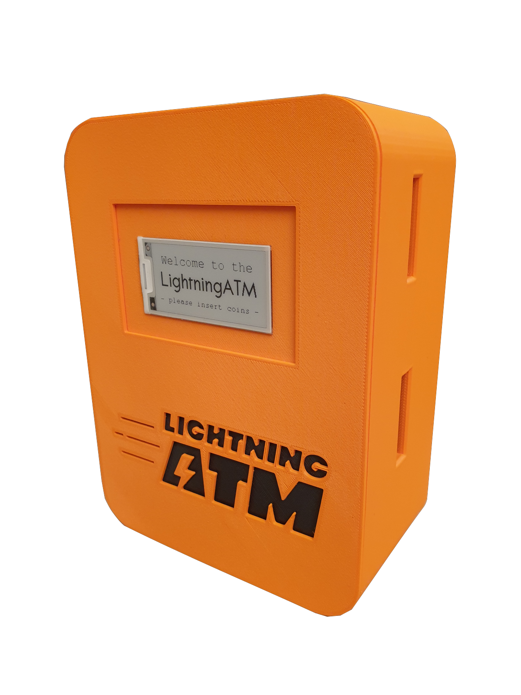

# LightningATM

This LightningATM was built to distribute small amounts of BTC - obviously - it only accepts coins. It shall demonstrate the power of Bitcoins Lightning Network. A two cent coin is enough to buy some satoshis at the LightningATM.

A physical coin exchanged into bitcoin and send to your lightning wallet in seconds. Use this project to educate your family and friends or guests at your bitcoin meetup - a convenient and easy on-boarding process for people that are new to bitcoin.

**Please be aware that this is a hobbyist project and it is not secure and reliable enough to withstand attacks. I discourage the use of this setup in a professional environment - but it's rather a good educational tool**

There are currently two versions of the Lightning ATM. The large full version with a camera for scanning invoices and a button for acknowledgment and other functions. And there is the somewhat slimmed-down version for mobile use, the pocket version.

Full Version             |  Pocket Version
:-------------------------:|:-------------------------:
  |  

### Required components

- [parts list](/docs/guide/parts_list.md)

### Installation guideline

_Carry out the points step by step as described here. This is the quickest way to succeed._ 😊

- [voltage converter](/docs/guide/voltage_converter.md)
- [coin validator](/docs/guide/coin_validator.md)
- [wiring](/docs/guide/wiring.md)
- [sd card and wifi](/docs/guide/sdcard_and_wifi.md)
- [display](/docs/guide/display.md)
- [edit config.ini](/docs/guide/edit_config.md)
- [debugging and tmux](/docs/guide/tmux_monitoring.md)
- [autostart](/docs/guide/autostart.md)
- [aditional information and tips](/docs/guide/information_and_tips.md)
- [option: language](/docs/guide/languages.md) 
- [option: button](/docs/guide/button.md)
- [option: camera](/docs/guide/camera.md)
- [option: lockout relay](/docs/guide/relay.md)
- [option: RPi image from scratch](/docs/guide/add_on_zero2.md)

If you want to update your ATM version, see this guide: [Update](/docs/guide/we_need_your_help.md)

More information of how to setup the LightningATM can be found here https://docs.lightningatm.me. Also join the Telegram group of LightningATM builders here https://t.me/lightningatm_building or contact 21isenough on Twitter (https://twitter.com/21isenough).

To see the Lightning ATM in action, check out this video [LightningATM in action](https://twitter.com/21isenough/status/1170808396955738114?s=20)

### Mentioned
- https://podcasts.apple.com/us/podcast/interview-with-21isenough/id1481514734?i=1000458712983
- https://blog.sicksubroutine.com/lightning-junkies-episode-021/
- http://bitcoin-turm.de/bturm29/
- https://www.atmmarketplace.com/articles/lightning-atm-lets-you-buy-itty-bitty-amounts-of-bitcoin/
- https://www.bitcoinmedia.id/atm-bitcoin-lightning-ini-adalah-prototype-pertama/
- https://twitter.com/CoinATMRadar/status/1202657309765357568?s=20
- https://www.hackster.io/news/lightningatm-distributes-small-amounts-of-btc-over-the-lightning-network-5e03347acd88
- https://criptonizando.com/2019/10/08/desenvolvedor-cria-caixa-eletronico-de-bitcoin-que-ate-amadores-podem-construir-usando-a-lightning-network/
- https://decrypt.co/10046/ightningatm-how-to-make-your-own-bitcoin-atm?utm_content=buffer7dcee&utm_medium=social&utm_source=twitter.com&utm_campaign=buffer

### Documentations in other languages

- German Video: [Tutorial - Bitcoin Lightning ATM - montieren und konfigurieren](https://www.youtube.com/watch?v=pTyTc2qPQj0)
- German tutorial for the pocket edition: [Tutorial LightningATM - ereignishorizont.xyz](https://ereignishorizont.xyz/lightning-atm/)

### Todo list

#### Prio 1
- [ ] Implement lndconnect
- [ ] Add "no wallet setup" warning at boot
- [ ] Implement LNURLProxyAPI
- [ ] Support for more Lightning implementations and wallets
- [ ] Try different way of detecting inserted coins (populating a list and setting a delimiter)
- [ ] PCB Board design (https://easyeda.com/, http://kicad.org/)
- [ ] 5V-12V step up transformer (http://www.electronics-lab.com/project/5v-to-12v-step-up-dc-dc-converter/)
- [ ] Solve security concerns in regards to lnurl (scan over the shoulder)
#### Prio 2
- [ ] Dashboard for settings (via mobile)
- [ ] Add second button and admin menu
- [ ] Add admin function only available through qr pass
- [ ] Run certain functions in threads
- [ ] Additional button for restart and shutdown
- [ ] Find solution to work without jumper cables
- [ ] Add encrypted partition with sensible data
#### Prio 3
- [ ] Add TOR support for LND calls
- [ ] Store data in database
- [ ] Add AP option for users to login into their wifis (https://github.com/21isenough/RaspiWiFi)
- [ ] 2 layer for coins to reject before accepted
#### Done
- [X] Update doc with new features, screens
- [X] Check out BTCPay API to integrate backend
- [X] Add coin return stopper to 3d design
- [X] Try different e-ink screen
- [X] Add a language file to change strings easily
- [X] Write installations instructions (see docs.lightningatm.me)
- [X] Rethink the design decisions in regards to hardware (https://www.arrow.com/en/products)
- [X] Add encryption of admin.macaroon in idle mode
- [X] Design ideas for case
- [X] Slightly recline front board to the back, add immersion for camera
- [X] Move scanning function into utils
- [X] Move all display functions into display.py
- [X] Implement lnurl with lntxbot
- [X] Draw printer and boards in 3D (https://www.onshape.com/)
- [X] Write list of all compatible wallets/qr qr_codes
- [X] Test qr code on 2" eInk display (works)
- [X] Research camera resolutions / qr code scanning
- [X] Check if there's other zbar python libraries
- [X] Change to wide angle camera
- [X] Sort out scan errors
- [x] QR code scan function
- [x] Validate requested amount
- [x] Reject to high amounts
- [x] Add config file
- [x] Add parts list to readme
- [x] Ask for rescan of QR code
- [x] Inform about failed scan
- [x] Implement continuous QR Scan
- [x] Lower case ln invoices
- [x] Find a faster solution for QR scans (zbarcam)
- [x] Organize todos better

