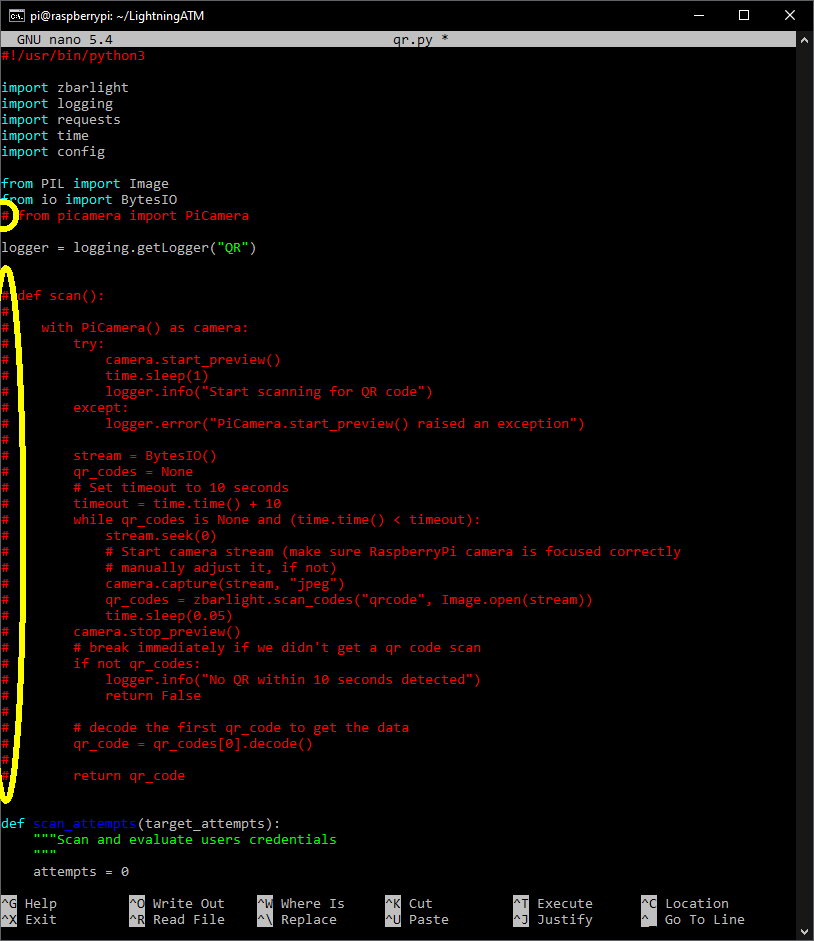

## Raspberry Pi Zero 2 image from the scratch

#### `Warning:` It is not recommended to use the RPi Zero 2 for the Lightning ATM. However, if you already have one, you can use this guide to get it working. 

The Raspberry Pi Zero 2 requires a 64-bit operating system. The tried and tested "2019-04-08-raspbian-stretch-lightningatm.gz" image does not run on the Zero 2. Accordingly, a new image must be created that supports the 64-bit architecture. The current [Bullseye](https://en.wikipedia.org/wiki/Raspberry_Pi_OS) version does this. This image can be used for this, but still needs to be modified so that it can be used for the Lightning ATM.

Unfortunately, not all components are directly compatible with the new version. In the first step, only the Waveshare displays are compatible and the camera has to be dispensed with for the time being.
  
This guide to creating a compatible version is only a guide. Deviations are possible and maybe even necessary. For the best result, however, it is recommended to stick to the procedure. Otherwise, troubleshooting support will be difficult. Since this is an experimental setting, any guarantee or warranty is excluded.
  
### The individual steps:

1. Creation of the raw image
2. Write the raw image with SSH and Wifi data
3. First start and first settings
4. Carry out updates and installations
5. Install and test the display
6. Edit utilis.py and qr.py file
7. Create and edit the config.ini
8. Postprocessing

---

### 1. Creation of the raw image

Find the appropriate Raspberry Pi OS (64-bit) image from the [Archive](https://downloads.raspberrypi.org/raspios_arm64/images/) and download it. You can use a newer version, but the "2022-01-28-raspios-bullseye-arm64.zip" version was tested for this tutorial. Unpack the file and write the image with [balenaEtcher](https://www.balena.io/etcher/). When done, remove the microSD.

### 2. Write the raw image with SSH and Wifi data

- Create an empty file named "SSH" in preparation. Make sure that the file has __no__ file extension such as ".txt". It is just called SSH and will later activate the SSH connection on the Raspberry Pi.
- Create a "wpa_supplicant.conf" file as described in chapter [sd card and wifi](/docs/guide/sdcard_and_wifi.md). This gives the Raspberry Pi the necessary information about your Wifi.
- Put the newly written microSD back into the computer slot and copy both files into the "boot" directory.
- Remove the microSD. It is now ready for the Raspberry Pi Zero.

### 3. First start and first settings

 
After starting the Zero 2 and waiting a few minutes. Then you can log in as described in the [sd card and wifi](/docs/guide/sdcard_and_wifi.md) chapter.

- Change the password and remember it!

		$ passwd
		
-   Activate the SPI interface for the display.

		$ sudo raspi-config


- Exit with "Finish".

### 4. Carry out updates and installations

Run the following commands one by one.
```
	$ sudo apt update && sudo apt upgrade
	$ git clone https://github.com/21isenough/LightningATM.git
	$ cd ~/LightningATM/
	$ sudo apt-get install libzbar0 libzbar-dev
	$ pip3 install -r requirements.txt
```
Note: When updating, you sometimes have to confirm with `y`.

### 5. Install and test the display

As described in the [display](/docs/guide/display.md) chapter.

### 6. Edit utilis.py and qr.py files

The driver for the PaPiRus display is not pre-installed in the 64-bit version and the driver currently used for the camera does not work with the 64-bit version. To ensure that they do not report a fault, the functions are deactivated here.

#### Edit utils.py

```
	$ cd ~/LightningATM/
	$ nano utils.py
```
Preassign the variable EPD_SIZE with 2.0, because the called directory for the PaPiRus display initial values are not existing.


Save and exit the editor: `CTRL+x -> y -> ENTER`.

#### Edit qr.py

```
	$ cd ~/LightningATM/
	$ nano qr.py
```

Make the following settings to disable the camera.



Save and exit the editor: `CTRL+x -> y -> ENTER`.

### 7. Create and edit the config.ini

Start the app.py once.


The program is immediately aborted with "Exiting..." because the wrong display is still stored in the basic setting. But the config.ini was created in the background and you can open and edit it as described in chapter [edit config.ini](/docs/guide/edit_config.md).

### 8. Postprocessing

Everything else is as usual and listed in the [README](/README.md).

Look at:

- [edit app.py](/docs/guide/edit_app.md)
- [tmux monitoring](/docs/guide/tmux_monitoring.md)
- [autostart](/docs/guide/autostart.md)

---

#### [information_and_tips](/docs/guide/information_and_tips.md)  ᐊ  previous | next  ᐅ  [README](/README.md)
