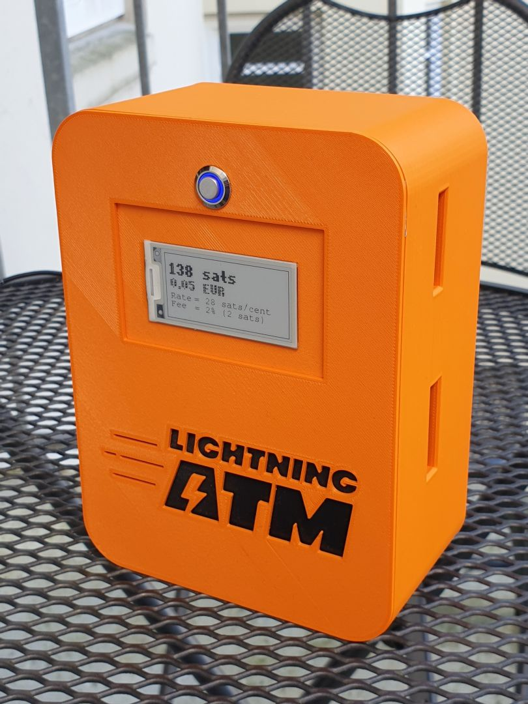
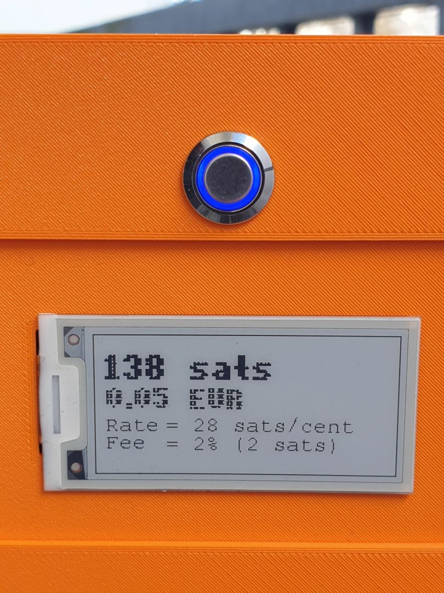
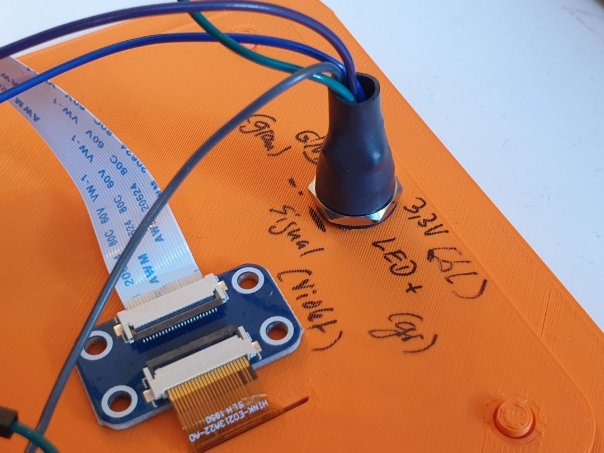
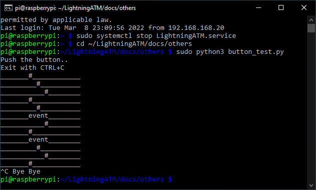
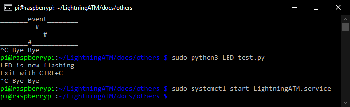

##  Installation and testing the button

The most sensible option for the LightningATM is probably the button. An LED button is a nice feature but not essential, a simple button will do. 
With a button you can trigger the confirmation for the withdrawal process manually and is not dependent on a time control after inserting a coin. 
That makes it a little more relaxed. You can also use the button to access additional options.

When the start screen is displayed, the button has four functions depending on the number of button presses:

1 : Shows screen: "No coins added! Please add coins first"  
3 : Simulates adding a coin (2 coin pulses, only for testing)  
5 : Shutdown the host machine  
7 : Reset Wallet (!!!) an scan new wallet credentials with camera  

If coins have been inserted, the LED goes on and the button only has the function of starting the withdrawal process and generating the QR code or activating the camera for scanning.

`Attention:` Seven pulses reset the wallet. If you don't have a camera to scan a new one, then the ATM just shows the "Welcome" screen. You have manually to set a new wallet!

### Installation
  
The button is relatively easy to wire. See [wiring](/docs/guide/wiring.md). A soldering iron may be required. The individual poles must be measured unless this is clearly stated in the documentation for the button. The button closes the contact and is therefore NO (normal open) switching.

The LED is preferably designed for 3.3 V. Slightly different voltages (e.g. 5V) can still work. Classic doorbell buttons often meet this requirement.
It is important that you **not** connect the LED directly between LED+ and GND! The output current would overwhelm the Raspberry Pi and possibly destroy it. Therefore, a resistor must always be connected in series to limit the current. It's a bit dependent on the LED used, but 220 ohms is a guide. Of course without warranty and guarantee! DYOR

Here is an [example](https://www.amazon.de/dp/B00UFNI47I/) for a small LED button that also fits well in the pocket version.

Here is the back. Protects cable routing for less movement at solder joints and mark your cable color. 

### Testing

It is best to test the button and the LED once after the installation. We have prepared small programs for this purpose. Log in to the ATM via CLI as usual. To be on the safe side, terminate the ATM service so that there are no overlaps.

	$ sudo systemctl stop LightningATM.service

Change to the following directory

	$ cd ~/LightningATM/docs/others

#### Start the button test program

    $ sudo python3 button_test.py
    
Here you can see the two button pushes as "event".

####   Start the LED test program

    $ sudo python3 LED_test.py
    
The LED program shows only that it is working and the LED should now flash.

#### Do not forget

 Restart the ATM service

    $ sudo systemctl start LightningATM.service

---

#### [autostart](/docs/guide/autostart.md)  ᐊ  previous | next  ᐅ  [camera](/docs/guide/camera.md)
