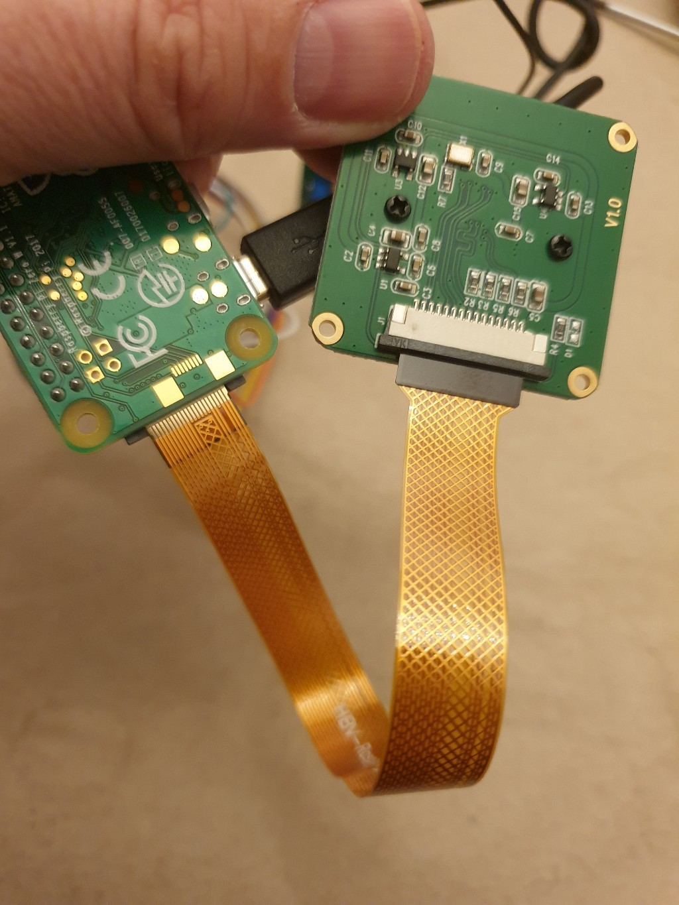
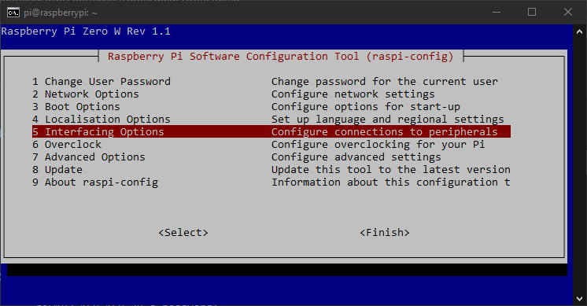
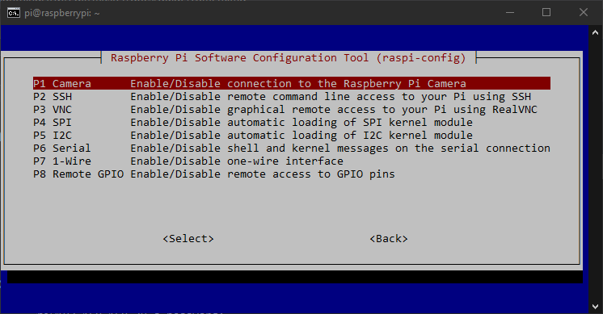
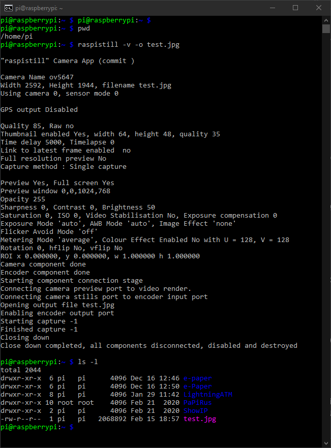
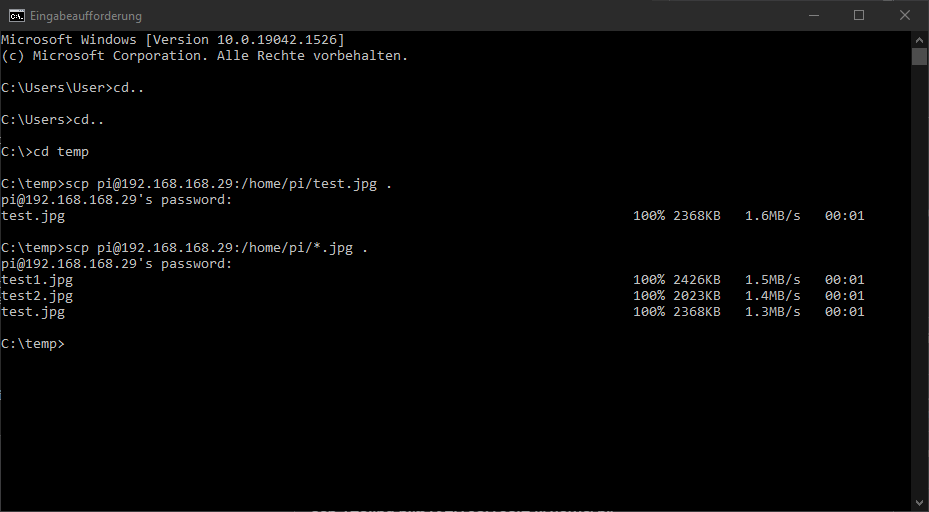
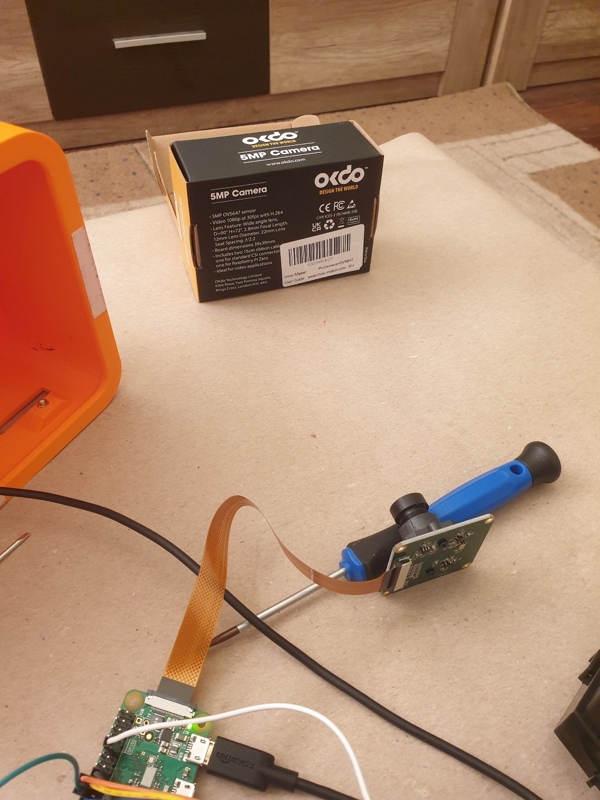
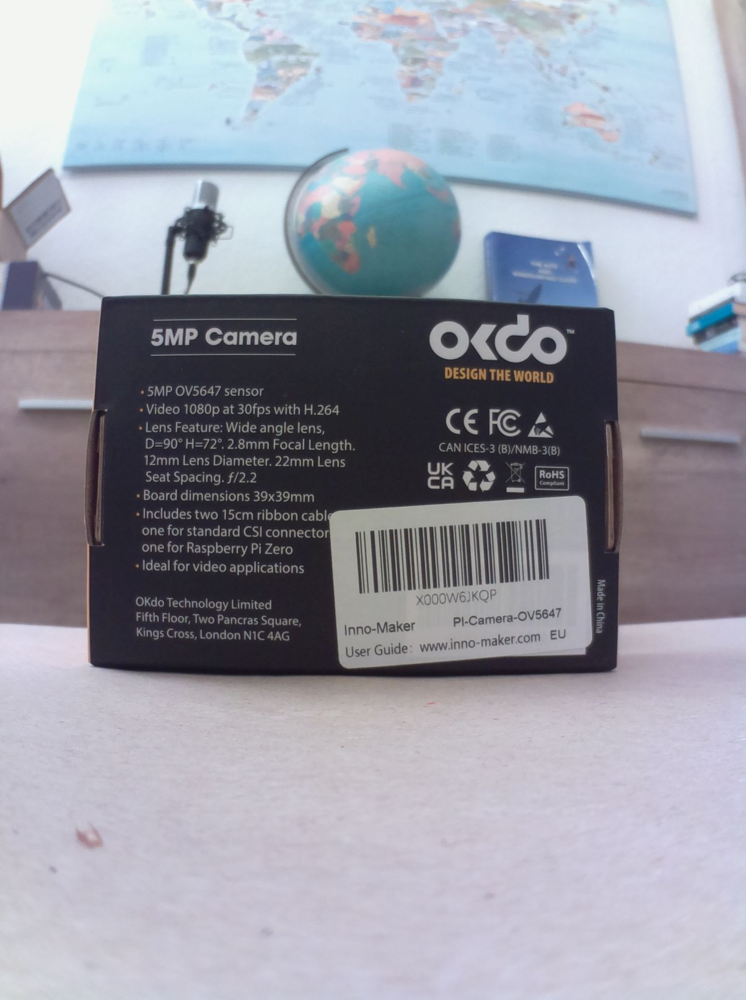

##  Installation and testing the camera

The camera is an optional feature and allows you to scan LNURL addresses. The 5MP Camera OV5647 is available from different manufacturers and with slightly different designs.
To test the function of the camera you can take a picture and download it to you computer.

### Installation

The ribbon cable is a bit special as the connectors on the camera and the Raspberry Pi are slightly different sizes. So the cable tapers.
Before sliding the cable into the slot, the black latch must be released by gently pulling upwards.
The cable can then simply be pushed in. The silver contacts must point away from the detent. See image!
When the cable is centered, you can lock the latches in place by sliding them back slightly.  

connection

### Activate camera

- Login to the Raspberry Pi

      $ ssh admin@192.168.x.x
      
- Directory displayed: `pi@raspberrypi:~ $`
    
- Call up the Raspi-Config and activate the camera

      $ sudo raspi-config
    
- Choose: `Interfacing Options  Configure connections to peripherals` 
- Choose: `Camera      Enable/Disable connection to the Raspberry Pi Camera`
- Confirm: `Would you like the camera interface to be enabled?` -> `\<YES>` 
- Confirm: `The camera interface is enabled` -> `\<OK>`
- Go To: `\<Finish>`
- When ask for: `Would you like to reboot now?` -> `\<YES>`
- If you have not already restarted from the menu, then restart manually to activate the changes

      $ sudo reboot
      
raspi-config
  

  
  Your config menu can look slightly different, depends of you hard- and software
      
### Take a picture

- Take a picture after logging in to the Raspberry Pi

      $ raspistill -v -o test.jpg

  Note: The -v is only optional and will show more display data. The -o is necessary to write the file.
    
The recording lasts 5 seconds (time delay 5000 (ms)). You can shorten the recording time, but you should not make the time too short, otherwise the picture quality will suffer. One second (= 1000 ms) is definitely possible. The command then looks like:
    
   $ raspistill -v -o test.jpg -t 1000
   
  Further functions for a recording can be found in the help `$ raspistill --help`
  
- Check if the image has been saved

      $ ls -l
      
  The file `test.jpg` should now appear in the list.
  
- Check the directory structure

      $ pwd
   
  The directory should read: `/home/pi/`
  
 raspistill command

 
  
 ### Transfer the image to the computer
 
 - Open a *second terminal window* on the computer
 - Switch to a folder of your choice (example `C:\temp`)
 - The command to copy for a Windows system is

       $ scp pi@192.168.x.x:/home/pi/test.jpg .
      
   -> The password from the Raspberry Pi must be entered for comfirmation

 - If everything went well, the image was transferred to the computer and can now be vieweden
      
 - Note: The command is slightly different on a Mac or Linux system

       $ scp 'pi@192.168.x.x:/home/pi/test.jpg' ./
       
scp command

 
 
Example of a recording

The structure            |  The picture
:-------------------------:|:-------------------------:
  |  

Note: This camera was pretty cheap and has a variable lens that was pretty loose and difficult to adjust. You might want to use a better one for your project.
      
### Aditional hints

- If you want to take several pictures, the pictures must be numbered consecutively. E.g. test1.jpg, test2.jpg etc.
- Then you can transfer all images at once

      $ scp pi@192.168.x.x:/home/pi/*.jpg .   or    scp 'pi@192.168.x.x:/home/pi/*.jpg' ./
      
- You can do also videos. The command is `raspivid`

---

#### [option: button](/docs/guide/button.md)  ᐊ  previous | next  ᐅ  [option: RPi image from scratch](/docs/guide/add_on_zero2.md)

