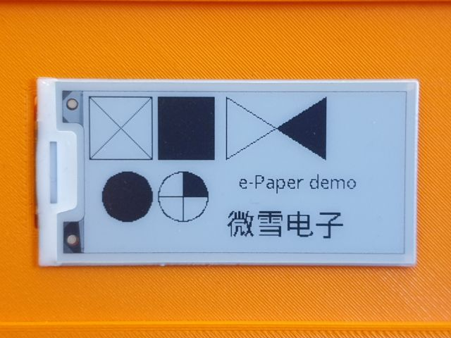

## Set up and test the display

### Update display software

```
$ cd
$ git clone https://github.com/waveshare/e-Paper
$ cd ~/e-Paper/RaspberryPi*/python
$ sudo python3 setup.py install
```

###  Testing the display

`Note:` This is special for the "Waveshare 2in13 V2". Yours may be different, **check your version** carefully!

```
$ cd ~/e-Paper/RaspberryPi_JetsonNano/python/examples
$ sudo python3 ./epd_2in13_V2_test.py
```

If everything has been correctly connected and installed, the display will now show a demonstration and finally the screen will cleare.

display demo



`Note:` If it dose not work, check the wiring and your display version again.

---

#### [sdcard_and_wifi](/docs/guide/sdcard_and_wifi.md)  ᐊ  previous | next  ᐅ  [edit_config](/docs/guide/edit_config.md)
