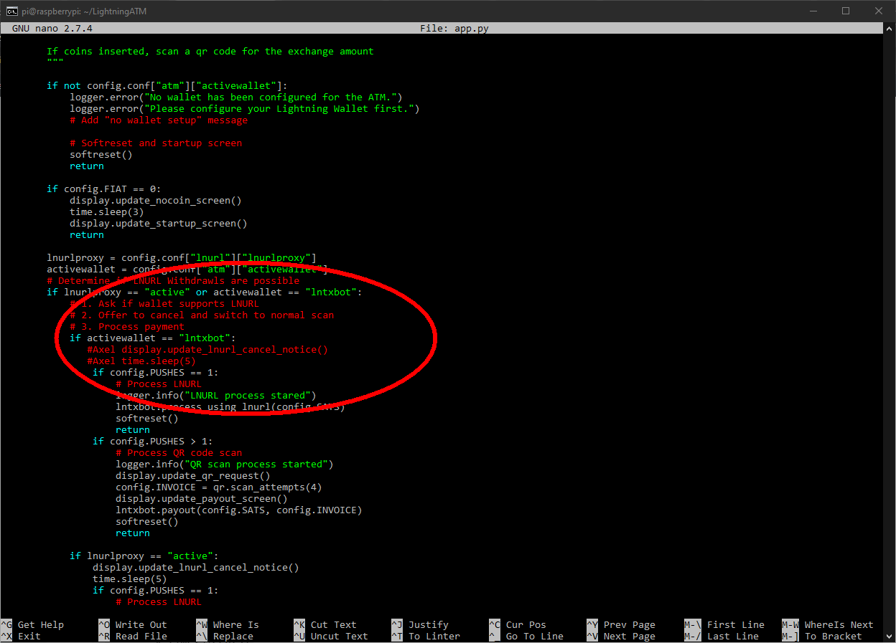

### Special settings in the app.py file

The `app.py` file is the main program of the ATM. Here you can easily customize the code. But be careful when making changes here.

##### Open the app.py

```
$ cd ~/LightningATM/
$ nano app.py
```

##### Optional setting *only for the pocket version:* Skip the "Prepare for LNURL" page:

- Search for `display.update_lnurl_cancel_notice()` with `CTRL+W` or just scroll down a few lines. 
- There is a place where it says `if activewallet == "lntxbot"`, please edit the two lines below (see picture)

###### Comment out the following two lines with `#`

```
	# display.update_lnurl_cancel_notice()
	# time.sleep(5)
```

-> This will skip the LNURL "query page" as it is not relevant to the pocket version 

app.py - Skip the "Prepare for LNURL" (example only für ATM without push button)


---

#### [edit_config](/docs/guide/edit_config.md)  ᐊ  previous | next  ᐅ  [tmux_monitoring](/docs/guide/tmux_monitoring.md)


