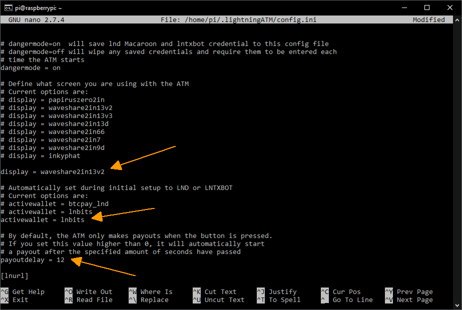

##  Setting the config.ini

Basic settings are made in `config.ini`. 

- Login on Raspberry Pi via CLI: `ssh pi@192.168.x.x`

### Start ATM once to create the config.ini

```
$ cd ~/LightningATM/
$ ./app.py
```

- When you first start you will get an "No display configuration matched. Exiting...".


- The config.ini has now been created in the background.
- Now edit the config.ini as described next step to set the display and other configurations.

`Note:` If the display is already set correctly, the process will not "Exiting..". You have to stop it with `CTRL+C`. 

### Open the config.ini file

```
$ nano ~/.lightningATM/config.ini
```

- Don't be surprised, the spelling is really `~/.lightningATM/config.ini` with a dot and lowercase letters.

### Set the config.ini file

#### Enter display type under `[atm]`

```
	display = waveshare2in13v2
```
`Note:` **Please compare your display type carefully!** Yours may require different settings and an incorrect setting will not work.

#### *Only for Pocket Version:* Delay time (set from 0 to 12 seconds)

```
	payoutdelay = 12 
```

- Its needed for the the pocket version, because it has no push button for confimrmation. The invoice will be generated automatically after 12 seconds.
- Note: If you have a button version, you must keep the 0.

#### Set activate wallet type / example LNbits 

- If you would like to set a BTCPayServer wallet, get further information here: [BTCPayServer](https://docs.lightningatm.me/lightningatm-setup/wallet-setup/lnd_btcpay)
- To use the Blink wallet as the funding source continue here: [Blink](/docs/guide/set_up_a_blink_wallet.md)
- Note: A quick guide how to set up an LNbits wallet find [here](/docs/guide/set_up_an_lnbits_wallet.md)

```
	activewallet = lnbits
```
#### Under `[lnbits]` customize the data for the LNbits wallet

```
[lnbits]
# api credentials
url = https://legend.lnbits.com/api/v1
apikey = 
# One of "invoice" or "lnurlw"
method = lnurlw
# only for lnurlw - millisseconds to redeem the lnurlw
timeout = 90000
```
Note: Here you only need to specify the `apikey`. You get this from the [LNbits wallet](/docs/guide/set_up_an_lnbits_wallet.md), e.g. `apikey = 8682516eaf0c457...`

#### Set the coins to the pulses

- Each coin generates a specific number of pulses. Here 2 to 7 pulses.

```
[coins]
# Pulsecount, fiat value, name
coin_types = 2,0.05,5  eur cent
             3,0.10,10 eur cent
             4,0.20,20 eur cent
             5,0.50,50 eur cent
             6,1.00,1 eur
             7,2.00,2 eur
```

- When you finshed with changings in the config.ini, save and exit the editor: `CTRL+x -> y -> ENTER`
- `Note:` In the config.ini you can also change the currency and fees.

config.ini part 1 (example)


config.ini part 2 (example)


#### Test the settings (or the entire ATM) once

- Start the ATM again

```
$ cd ~/LightningATM/
$ ./app.py
```

- The display should now show `LightningATM`
- If everything is entered correctly, the ATM should now be ready for use
- Just test it with few coins
- To stop the ATM just press `CTRL+C`
- After a short time, `Manually Interrupted` is displayed and you can see on the display that the `ATM is turned off`

display LightningATM


display ATM turned off!


- `Note:` If it doesn't work properly, you can run the debug logger with the command `tail -f ~/.lightningATM/debug.log` in a separate terminal window. We will show more information later in the chapter [`tmux`](/docs/guide/tmux_monitoring.md).
- `Note:` How to give the ATM an autostart function, you will learn later in chapter [`autostart`](/docs/guide/autostart.md)
- `Note:` If you have already set the autostart and also start the app.py manually as described here, the display will not work properly. Then first stop the service as described in [`autostart`](/docs/guide/autostart.md).

---

#### [display](/docs/guide/display.md)  ᐊ  previous | next  ᐅ  [debugging and tmux](/docs/guide/tmux_monitoring.md)


