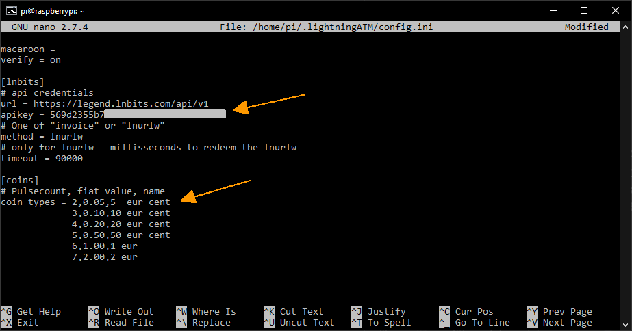

##  Setting the config.ini

Basic settings are made in `config.ini` 

- Login on Raspberry Pi via CLI: `ssh pi@192.168.x.x`

### Start ATM once to create the config.ini

```
$ cd ~/LightningATM/
$ ./app.py
```

- When you first start you will probably get an error message because the default display type is wrong. But you can ignore the message. The config.ini has now been created in the background.
- The "app.py" process can now be stopped with `CTRL+C`
- After a short time, `Manually Interrupted` is shown in the terminal window
- Now edit the config.ini as described below

### Open the config.ini file

```
$ nano ~/.lightningATM/config.ini
```

- Don't be surprised, the spelling is really `~/.lightningATM/config.ini` with a dot and lowercase letters

### Set the config.ini file

#### Enter display type under `[atm]`

```
	display = waveshare2in13v2
```
`Note:` Please compare the display type. Yours may require different settings.

#### *Only for Pocket Version:* Delay time (set from 0 to 12 seconds)

```
	payoutdelay = 12 
```

- Its needed for the the pocket version, because it has no push button for confimrmation. The invoice will be generated automatically after 12 seconds
- Note: If you have a button version, you must keep the 0.

#### Set activate wallet type / example LNTXBOT

- If you would like to set a BTCPayServer wallet, get further information here: [BTCPayServer](https://docs.lightningatm.me/lightningatm-setup/wallet-setup/lnd_btcpay)
- Note: A good guide to getting started with the LNTXBOT can be found here: [coincharge.io](https://coincharge.io/en/lntxbot-telegram-lightning-wallet/)

```
	activewallet = lntxbot
```

#### Under `[lntxbot]` enter the data for the API to the lntxbot

```
[lntxbot]
# base64 encoded lntxbot api credentials
url = https://lntxbot.com
creds = abc..xyz==
```
  
- Note: The LNTXBOT delivers `url` and `creds` with the command `/lightningATM` from you Telegram bot
- The structure from the bot answer is build up like: `<creds>@<url>`

#### Set the coins to the pulses

```
[coins]
# Pulsecount, fiat value, name
coin_types = 2,0.05,5  eur cent
             3,0.10,10 eur cent
             4,0.20,20 eur cent
             5,0.50,50 eur cent
             6,1.00,1 eur
             7,2.00,2 eur
```

- To save and exit the editor: `CTRL+x -> y -> ENTER`

config.ini part 1 (just an example)


config.ini part 2 (just an example)


#### Test the settings (or the entire ATM) once

```
$ cd ~/LightningATM/
$ ./app.py
```

- The display should now show `LightningATM`
- If everything is entered correctly, the ATM should now be ready for use
- It's best to just test it with a few cents
- If it doesn't work, the chapter with `tmux` will come later. You can make a diagnosis there
- To stop the ATM just press `CTRL+C`
- After a short time, `Manually Interrupted` is displayed and you can see on the display that the `ATM is turned off`

display with start screen


