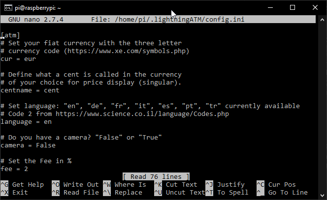
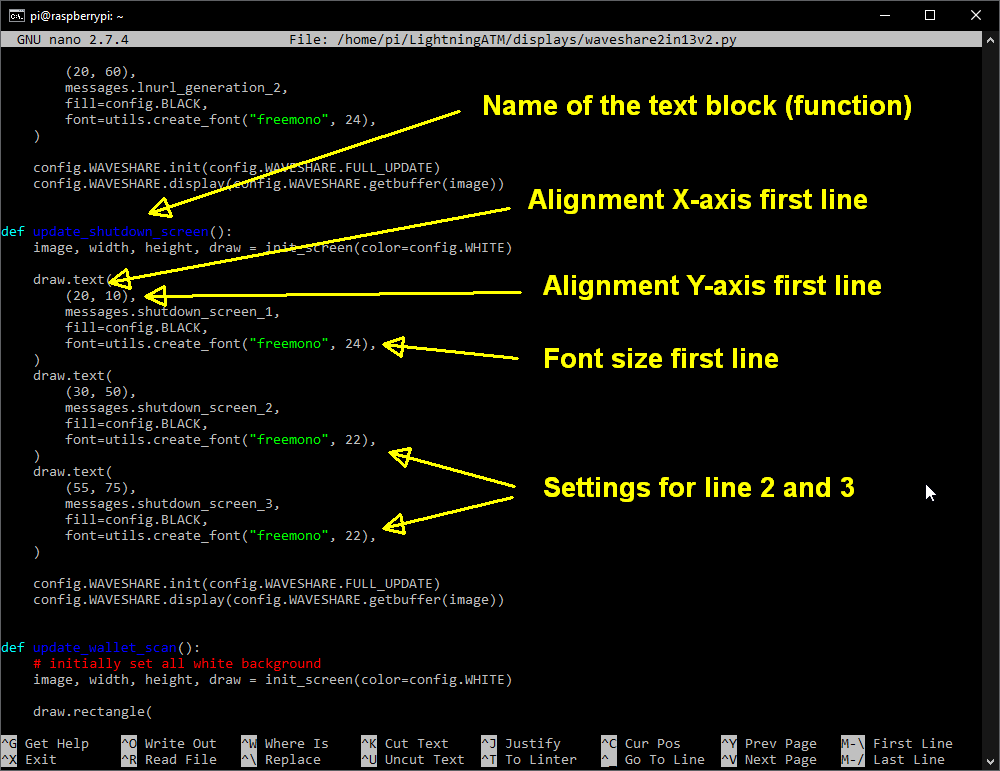
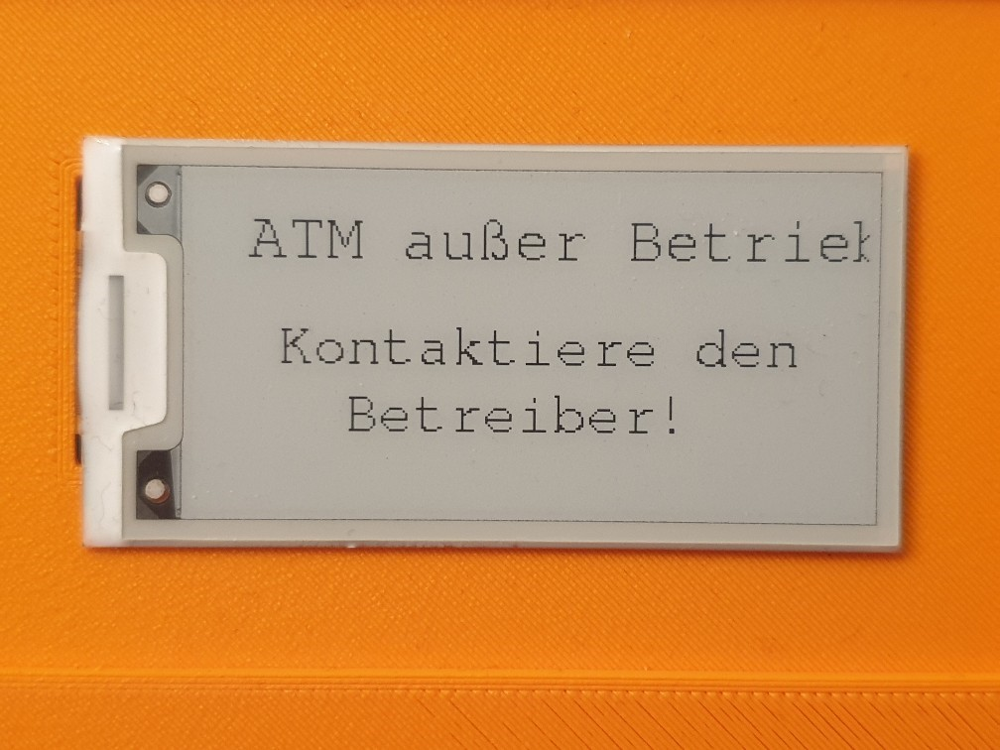
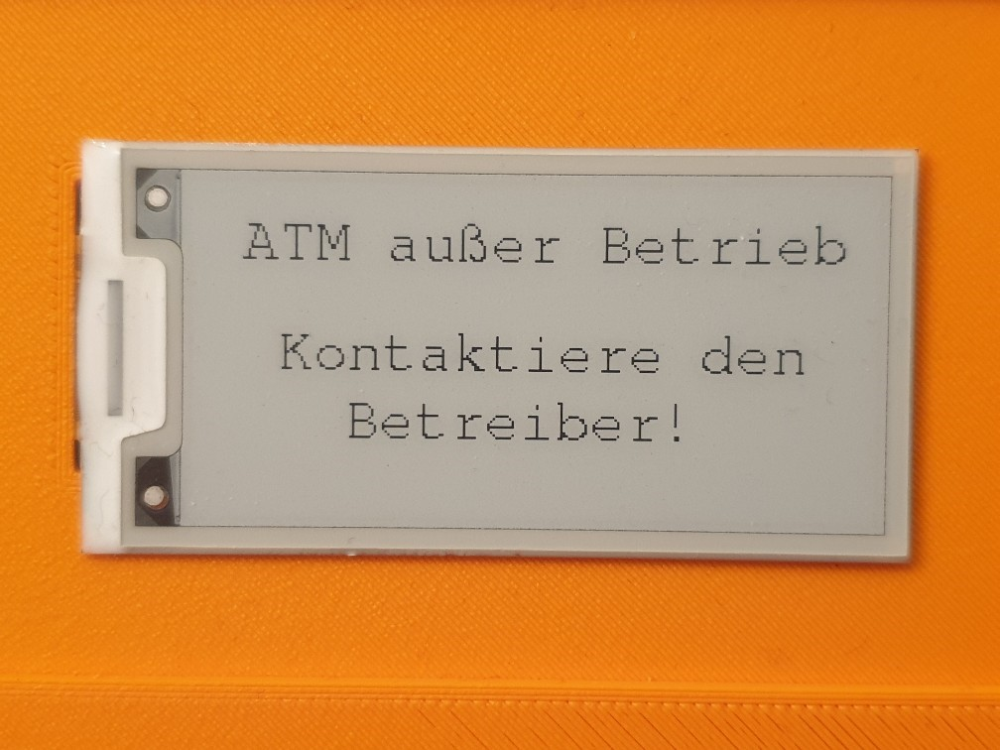
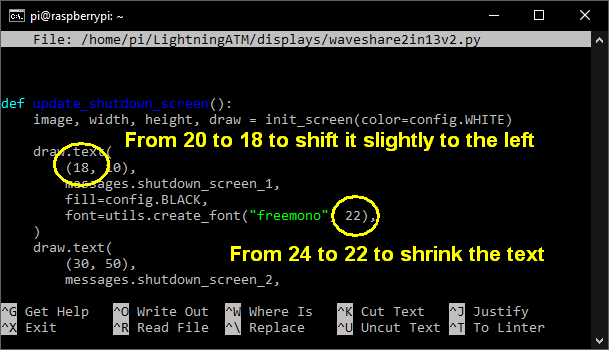

## How to set a another language

The ATM offers the option of setting a different language via `config.ini`. That's relatively easy. But in order to make the whole thing look nice, we still have to manually adjust a few texts for our display.

---

### 1. Set language in config.ini

To do this, you have to log in to the ATM via SSH `$ ssh pi@your-ip` and your password and then open the config.ini.

      $ nano ~/.lightningATM/config.ini

The config.ini:

Here you can select one of the languages. E.g. "language = de" for German. When you're done, save and exit the editor with `CTRL+x -> y -> ENTER`.

Now restart the ATM with the new language setting

    $ sudo systemctl restart LightningATM

### 2. The fine adjustments

You will probably not be entirely happy with the way the display looks. This is because the texts in the different languages ​​are of different lengths. The English language is also usually very short, which means that the translations often extend beyond the display and cut off words. Since the ATM supports different display types and we don't know many languages ​​will come, we can't set and fix all possibilities. So you have to set this up for your set yourself.

#### 2.1 View all pages one by one

If you have a button on your ATM, it's easy now. Simply press the button 5 times and all possible displays will be shown briefly once.

If you don't have one, you have to start a small program. To do this, log in again and enter the following commands one after the other.

    $ cd ~/LightningATM/
    $ python3 ./tests/displayalign.py

-> The ATM will now show all possible displays and finally restart itself, if the autostart is still acitve.

Now that you've seen all the display pages, you've probably noticed one or the other page where you might want to change the text position or the text size or maybe even the text itself. It's best to go through the whole thing again and take pictures of the displays you might want to change. You will then use these to identify the texts and make settings. 

#### 2.2 Change the text

That's the easiest. Just go to the text message file an edit it.

    $ nano ~/LightningATM/displays/messages_de.py

- If you want to change another language, just change the "messages_de.py" into "messages_es.py" for Spanish for example.
- Info: The english version is called "messages.py".
- After you are satisfied, save the changes and close the editor with `CTRL+x -> y -> ENTER`. Then test the whole thing again as described in point 2.1 or restart the ATM with `$ sudo systemctl restart LightningATM` to update and then press the button to see the messages again.
- `One request:` If you think your translation works well and you want to help us, please copy and paste the entire text into a plain text file like "messages_xx.txt" and DM it to AxelHamburch from the Telegram Group. 🙏

Example: messages_de.py

#### 2.3 Alligne the text

Now comes a slightly difficult part. You can adjust the font size and text position for each display. To do this, you first need to know which display type you have and secondly what the text block (function) is called that you want to edit. You can get the display type from "config.ini" and it is in between "display = ". For example: "waveshare2in13v2". The best way to get the name for the text block is from the text display messages. See point 2.2. This can be e.g. `# Text for update_startup_screen()`. The text block is therefore called `update_startup_screen()`.

Now you going to edit the Python file for the display and look for the text block (function).

     $ nano ~/LightningATM/displays/waveshare2in13v2.py

- `Note:` Swap the "waveshare2in13v2.py" to your display type you use. E.g. "waveshare2in13d.py" for the D version.

Here is an example for the "update_shut_down" text block (function):

The before and after pictures:

before           |  after
:-------------------------:|:-------------------------:
  |  

The alignment for the above before / after pictures:

If you set everthing you think it will help, exit the editior with `CTRL+x -> y -> ENTER` and restart the ATM `$ sudo systemctl restart LightningATM` or got to point 2.1 and start the test program again to see the result. 

### Annotation

I hope this could help you and you are happy with the result. 💛

`Note:` We recommend backing up your changes somewhere. Just copy the text or parts of it and save it somewhere convenient. If you update once the ATM, your changes are gone. So you can easily restore your settings again.

`Note:` If you have problems and don't know where they come from, you can [update](/docs/guide/we_need_your_help.md) the ATM. Then everything except the config.ini is overwritten and is new. Everything should be fine again and you also have the latest version.

---

#### [information_and_tips](/docs/guide/information_and_tips.md)  ᐊ  previous | next  ᐅ  [option: button](/docs/guide/button.md) 
