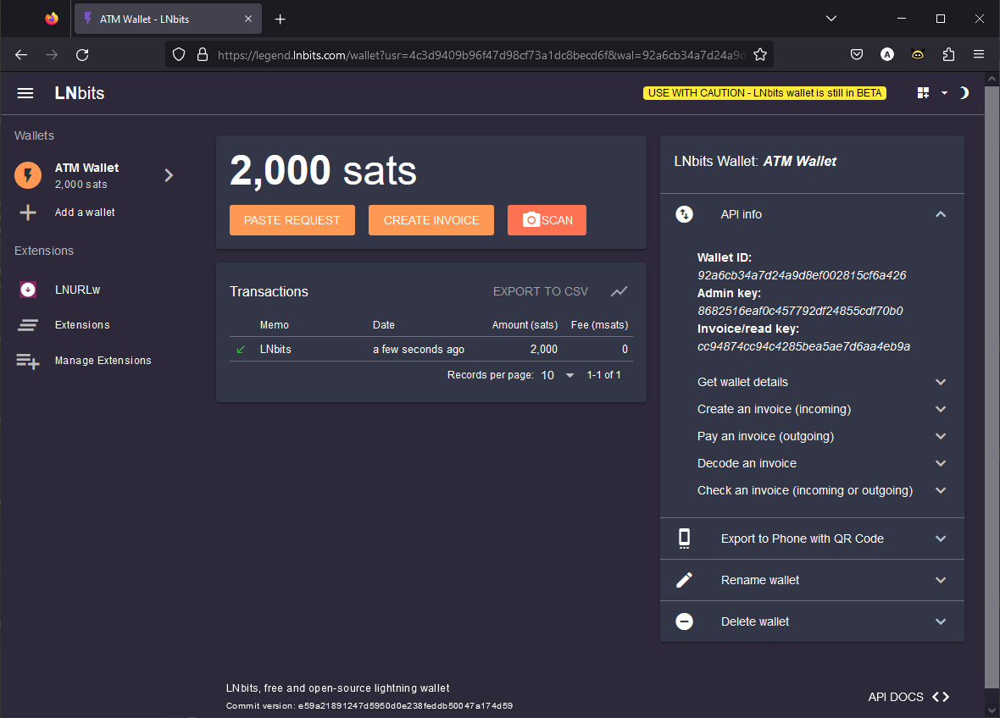
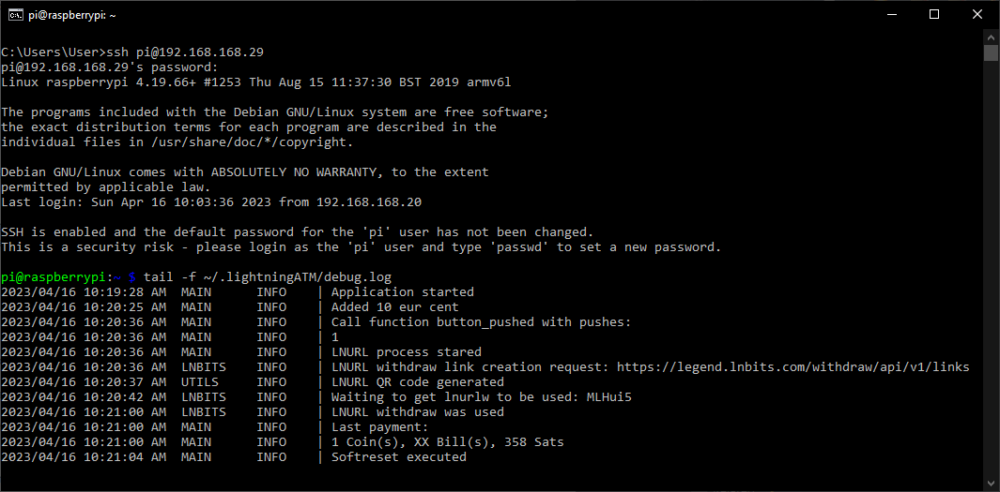

## Instruction to update the ATM 📜🧐

We have now added LNbits as a new funding source for the LightningATM. 🎉

### 1. Quick guide on how to set up an LNbits wallet

- Go e.g. to the [ledgend.lnbits.com](https://legend.lnbits.com/) demo server
- Assign a name and press `ADD A NEW WALLET`
- Bookmark the page and/or copy and paste the URL to a safe place. This will log you in to your wallet.
- Understand the warning! It is a demo server for testing. Keep only the necessary Satoshis in the wallet. 
- See a pop-up menu box on the right or bottom labeled `API info` and open it.
- You should see `Admin key: 8682516eaf0c457...`. The number-letter combination is the 'apikey' that you will need afterwards.
- But before that you need to install an extension. Go to `Extensions`, search for `LNURLw` and activate it with `ENABLE`.
- Fund the wallet with a few thousand Satoshis.

LNbits Wallet


### 2. Update the LigthningATM 

Connect the ATM to the power supply and log in to your LightningATM via [Wifi/SSH](https://github.com/21isenough/LightningATM/blob/master/docs/guide/sdcard_and_wifi.md#carry-out-basic-software-settings-and-updates). You may find the IP in the network of your router. Open a command line editor and write the command `ssh pi@192.168.x.x`. Hopefully you still have the assigned password. We will now load the new repository on the ATM and activate it. You have to stop the `LightningATM.service` once, otherwise you will get a strange display and the ATM will not work properly.  

    $ sudo systemctl stop LightningATM.service
    $ cd ~/LightningATM
    $ git pull
    
Now your ATM is set to the new version. Next you have to configure it for the new wallet.
    
### 3. Edit the config.ini

    $ nano ~/.lightningATM/config.ini

#### Add the following lines at the very end

```
[lnbits]
# api credentials
url = https://legend.lnbits.com/api/v1
apikey = 
# One of "invoice" or "lnurlw"
method = lnurlw
# only for lnurlw - millisseconds to redeem the lnurlw
timeout = 90000
```

`Note:` Customize your `apikey = 8682516eaf0c457...` from the LNbis wallet.

#### Change active wallet to lnbits

    [atm]
    ..
    activewallet = lnbits
    
#### Check the config.ini again

One or the other may have an older version of the LightningATM. Two things have been added. The option language and camera. Check if you have the following variable under [ATM]. If not, add them.

    [atm]
    ..
    # Set language: "en", "de", "fr", "it", "es", "pt", "tr" currently available
    language = en

    # Do you have a camera? "False" or "True"
    camera = False
    
Example, see [here](https://github.com/21isenough/LightningATM/blob/master/example_config.ini).
    
Save and exit editor: `CTRL+x` -> `y` -> `Enter`
   
### 4. Start ATM for testing

    $ cd LightningATM
    $ ./app.py

- It takes a few seconds for the display to update..
- The ATM has started and you can use it normally or test the functions.
- Stop the ATM with `CTRL+C`

To debug: Launch a second terminal window, login with ssh and access logs with 

    $ tail -f ~/.lightningATM/debug.log
    
Log file to debug


### 5. Final step

Restart the LightningATM service

    $ sudo systemctl start LightningATM.service

- Your ATM should now restart as usual

## Thank you for your patience! ❤
