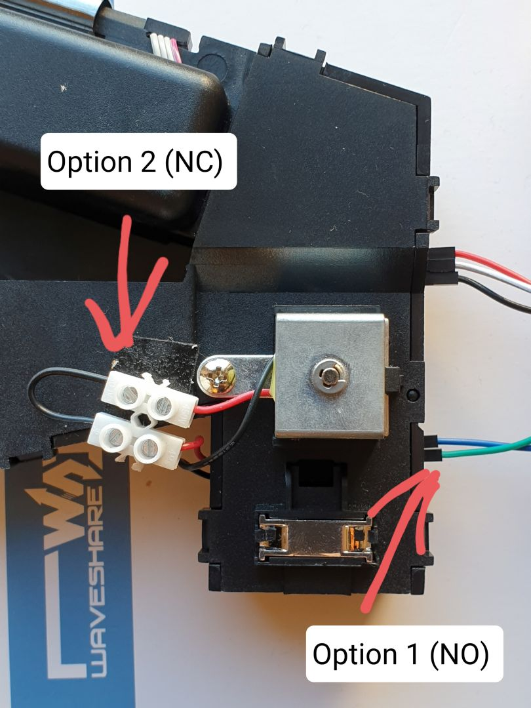
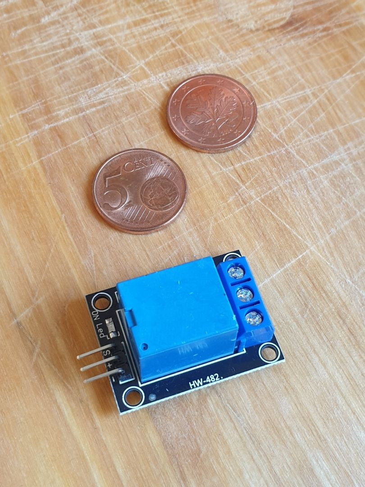
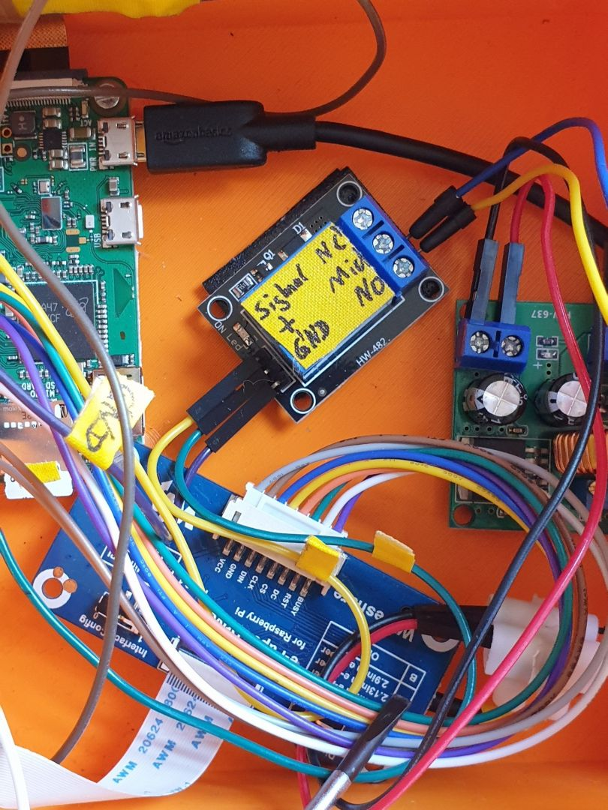
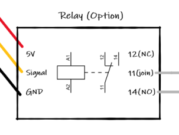
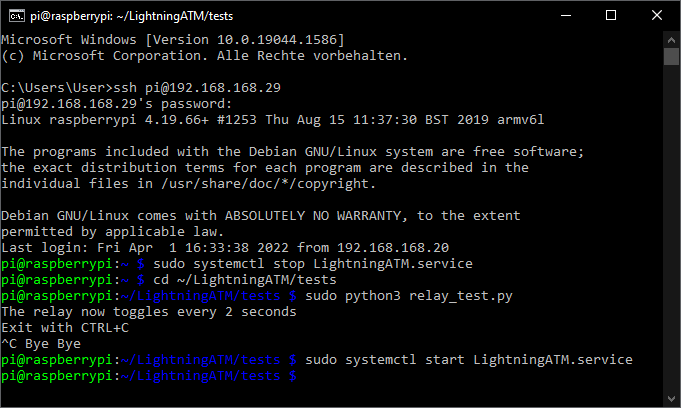

# Coin acceptor lockout relay / electromagnetism gate

## The electromagnetic gate 

The electromagnetic gate is a blocking pin that diverts the coins to the ejection. When the coin validator is de-energized, the pin always remains locked and ejects all coins. The blocking pin is only pulled back by a magnetic coil when the coins are correctly recognized. Only then do the coins fall through into fiat hell. This electromagnetic gate can be controlled or blocked from outside. The function can be used to exclude multiple impulses (in the case of fast coin insertion in a row) or coin insertion during a certain period of time (a display reading or with AMT offline).

## There are two ways to lock the electromagnetic gate

1. Via the "SET" input on the ATM. It is always "open / not connected" by default. The electromagnetic gate is only locked when these two contacts are short-circuited, or released when the contact is opened / not connected again.
2. The interruption of the coil control. To do this, however, you have to cut open the line and put a clamp in between so that you can loop in a contact there.

Relay options



Which option you choose is up to you. Option 1 is certainly the easiest. However, plugging in the cables can prove difficult. I finally decided on option 2 because the clamp connection seemed more stable than the plug connection. But it doesn't matter which variant you choose, you just have to make sure that you use the opener or the closer contact. 

## The Relay Module

A potential-free contact is required to switch the contact for the coin checker. A relay module with a changeover contact is ideal here.

Relay           |  build in
:-------------------------:|:-------------------------:
  |  

For a special typ, see [parts_list](/docs/guide/parts_list.md).

## Wiring

You can find the contacts / wiring for the relay here  and in total [here](/docs/guide/wiring.md).

When the relay is not energized, terminal 11 is the common contact and the contact to terminal 14 is open (NO = normal open). Terminal 12 is closed when unswitched (NC = normal close). If the coin acceptor is "released", then the whole thing is reversed.

## Relay Test

If you want to test the relay, we have a small test program here. It toggles the relay on and off alternately every two seconds. After starting the ATM, log in to the AMT via SSH and gradually enter the following command, similar to the button and LED tests in the [button](/docs/guide/button.md) chapter.

```
	$ sudo systemctl stop LightningATM.service
	$ cd ~/LightningATM/tests
	$ sudo python3 relay_test.py
	$ sudo systemctl start LightningATM.service
```

Relay test



## The result

Once everything has been wired and is back in operation, you should notice the following:

1. ATM power off: All coins are ejected.
2. ATM Ready: Coins are accepted.
3. Coin inserted: Relay switches for a short time and ejects all new coins immediately. Only when the display has updated is the coin validator released again.
4. The ATM shows the QR code: The coin validator is blocked, the coins are ejected.
5. You have a different display than the start display (selection for versions with a button): The coin validator is blocked.
6. The ATM is out of service: The coin validator is blocked.


If the ATM is ready but does not accept the coins, then check whether the relay switches is on (see LED) after the AMT has started up. If the relay works an you still can't insert coins, swap the terminals 12 and 14.

---

#### [option: camera](/docs/guide/camera.md)  ᐊ  previous | next  ᐅ  [option: RPi image from scratch](/docs/guide/rpi_image_from_scratch.md)