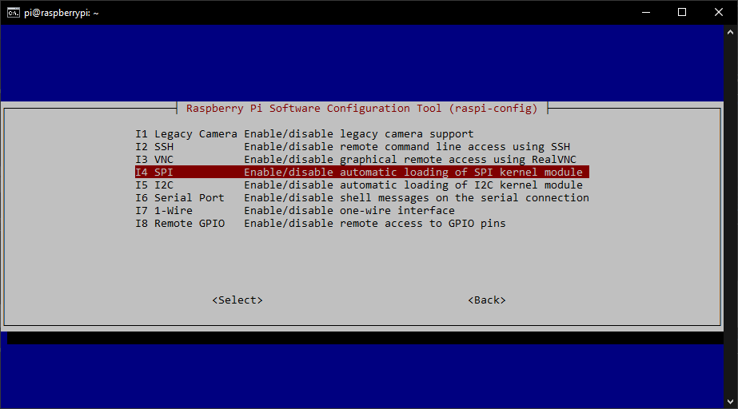
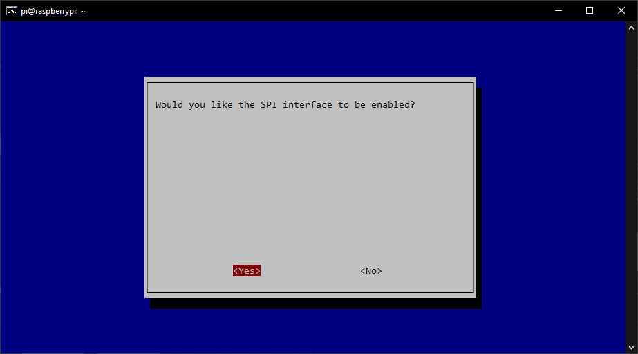
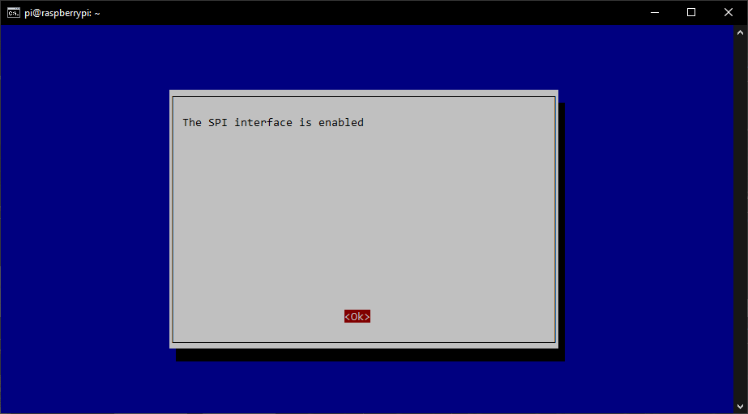
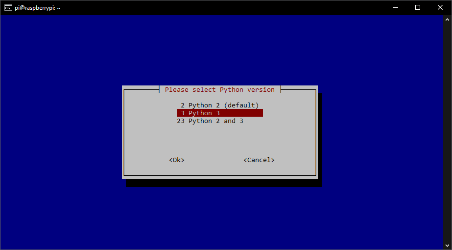
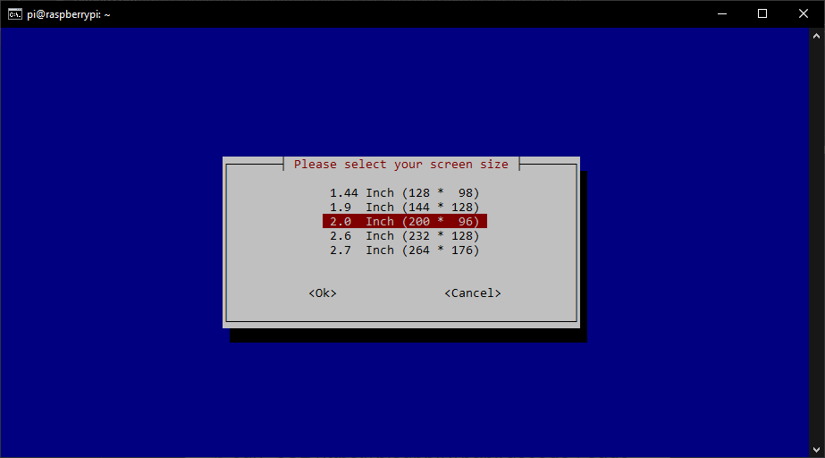

## Raspberry Pi image from scratch

### For example for the RPi Zero 2 or using new version of Raspibian as Bullseye in any other RPi.

#### `Warning:` It is not recommended to use the RPi Zero 2 for the Lightning ATM. However, if you already have one, you can use this guide to get it working. 

The Raspberry Pi Zero 2 is not supported in the Raspberry "Stretch" version. The tried and tested "2019-04-08-raspbian-stretch-lightningatm.gz" image does not run on the Zero 2. Accordingly, a new image must be created that supports the RPi Zero 2. The current [Bullseye](https://en.wikipedia.org/wiki/Raspberry_Pi_OS) version (32-bit) does this. You can use Bullseye image, but still needs to be modified so that it can be used for the Lightning ATM.

Unfortunately, Bullseye does not support all components directly. The Waveshare displays are direct compatible and for the PaPiRus displays you have to install the library. 
  
This is only a guide for creating a compatible version. Deviations are possible and maybe even necessary. For the best result, however, it is recommended to stick to the procedure. Otherwise, troubleshooting support will be difficult. Since this is an experimental setting, any guarantee or warranty is excluded.
  
### The individual steps:

1. Download and burn the raw image
2. Add SSH, userconf and Wifi data to the raw image
3. First start and first settings
4. Option: Install PaPiRus display library 
5. Carry out updates and installations
6. Install and test the display
7. Create and edit the config.ini
8. Postprocessing

---

### 1. Download and burn the raw image

Find the appropriate Raspberry Pi OS (32-bit) image from the raspberrypi.org [Archive](https://downloads.raspberrypi.org/raspios_armhf/images/) and download it. You can use a newer version, but the "2022-01-28-raspios-bullseye-armhf.zip" version was tested for this tutorial. Unpack the file and write the image with [balenaEtcher](https://www.balena.io/etcher/). When done, remove the microSD.

### 2. Add SSH, userconf and Wifi data to the raw image

- Create an empty file named `SSH` in preparation. Make sure that the file has __no__ file extension such as `.txt`. It is just called `SSH` and will later activate the SSH connection on the Raspberry Pi.
- Create a `wpa_supplicant.conf` file as described in chapter [sd card and wifi](/docs/guide/sdcard_and_wifi.md). This gives the Raspberry Pi the necessary information about your Wifi.
- Create a file named `userconf` with __no__ file extension and add the next content:
	```
	pi:$6$AkXCaGAo9kHlKdQS$FOsYUzv6Ypm/QEw78HBidWQtT1n83T4IsQcmDsWdOfZDgHTd1HUoVT6c3VZ6WDHC36/OHt380mIFiMyHlAU8A/
	```
	This content sets the password for the `pi` user to `password`. In newer versions as Bullseye the default password is not set automatically so we need to make this step.
- Put the newly written microSD back into the computer slot and copy the three files into the "boot" directory.
- Remove the microSD. It is now ready for the Raspberry Pi.

### 3. First start and first settings

After starting the Zero 2 and waiting a few minutes. Then you can log in as described in the [sd card and wifi](/docs/guide/sdcard_and_wifi.md) chapter.

- Change the password and remember it!

		$ passwd
		
-   Activate the SPI interface for the display.

		$ sudo raspi-config






- Exit with "Finish".

### 4. Option: Install PaPiRus display library 

If you use a PaPiRus Display, you have to install the PaPiRus display library. If you have a Waveshare or other, you can cancel this step.

	$ curl -sSL https://pisupp.ly/papiruscode | sudo bash

Set it to Python 3



Choose your display size




### 5. Carry out updates and installations

It's the same like described in chapter [sdcard_and_wifi](/docs/guide/sdcard_and_wifi.md). Run the following commands one by one.

```
	$ sudo apt update && sudo apt upgrade
	$ git clone https://github.com/21isenough/LightningATM.git
	$ cd ~/LightningATM/
	$ pip3 install -r requirements.txt
```
Note: When updating, you sometimes have to confirm with `y`.

### 6. Install and test the display

Please refer to the [display](/docs/guide/display.md) chapter on docs.
The only difference is that you can use the latest version of the Waveshare library when installing:
```
$ cd
$ git clone https://github.com/waveshare/e-Paper
$ cd ~/e-Paper/RaspberryPi*/python
$ sudo python3 setup.py install
```

### 7. Create and edit the config.ini

Start the app.py once.


The program is immediately aborted with "Exiting..." because the wrong display is still stored in the basic setting. But the config.ini was created in the background and you can open and edit it as described in chapter [edit config.ini](/docs/guide/edit_config.md).

### 8. Postprocessing

Everything else is as usual and listed in the [README](/README.md).

---

#### [option: lockout relay](/docs/guide/relay.md)  ᐊ  previous | next  ᐅ  [README](/README.md)
