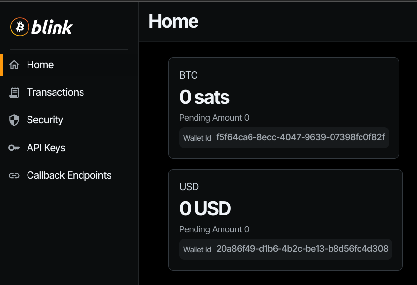
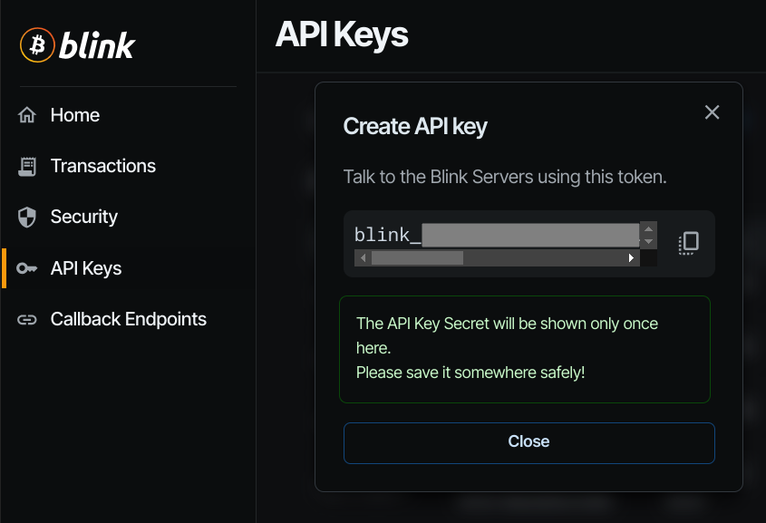

# How to set up a Blink wallet

This is a minimal guide to set up Blink (ex Bitcoin Beach Wallet) account as a funding source for the LightningATM.<br />
Get more info and download the app from [blink.sv](https://blink.sv). To learn more about the API visit [dev.blink.sv](https://dev.blink.sv) or discuss on the [Galoy Mattermost](https://chat.galoy.io).


## Get the credentials from the Blink Dashboard

* open the [Blink Dashboard](https://dashboard.blink.sv)
* log in with your email or phone number if you are using Blink already
* if you have no account yet can create a new one by logging in with a phone number

### Wallet ID
* once logged in to dashboard find the wallet IDs under the balances

  

* copy the BTC wallet ID to pay out from the BTC balance
* copy the USD wallet ID to pay out from the Stablesats balance
* paste the wallet ID into the config.ini file under the `[blink]` section

### API key

* create a new key on the `API Keys` tab
* give it a name and choose a `Scope` which permits to send payments (Read and Write)
* the default expiry is 90 days

  

* copy the key (starting with `blink_` ) and paste it into the config.ini file under the `[blink]` section

## Set the config.ini file

* in the `[atm]` section set the `activewallet` to `blink`

  ```
  activewallet = blink
  ```

* in the `[lnurl]` section set the `lnurlproxy` to `active`

  ```
  lnurlproxy = active
  ```

* the `[blink]` section must include these:

  ```
  [blink]
  graphql_endpoint = https://api.blink.sv/graphql
  wallet_id = 5dxxxxxxxxxxxxxxxxxxxxx
  api_key = blink_xxxxxxxxxxxxxxxxxxxxxxxxxxxxx
  ```

* A complete example of a `config.ini` using the pocket version of the ATM without a button with USD coins:
  ```
  [atm]
  cur = usd
  centname = cent
  language = "en"
  camera = False
  fee = 0
  dangermode = on
  display = waveshare2in13v2
  activewallet = blink
  payoutdelay = 10

  [lnurl]
  lnurlproxy = active
  lnurlproxyurl = https://api.lightningatm.me/v1/lnurl

  [btcpay]
  url =

  [lnd]
  macaroon =
  verify = on

  [lntxbot]
  url =
  creds =

  [lnbits]
  url = https://legend.lnbits.com/api/v1
  apikey =
  method = lnurlw
  timeout = 90

  [blink]
  graphql_endpoint = https://api.blink.sv/graphql
  api_key = blink_xxxxxxxxxxxxxxxxxxxxxxxxxxxxx
  wallet_id = 5dxxxxxxxxxxxxxxxxxxxxx

  [coins]
  coin_types = 2,0.01,1  usd cent
              3,0.05,5 usd cent
              4,0.10,10 usd cent
              5,0.25,25 usd cent
              6,1.00,1 usd
  ```

## Notes
* remember to top up the funding wallet with some sats
* easiest to monitor the payouts if you are logged in to the Blink app on your phone
* be aware when testing that paying the same account is not allowed (cannot withdraw from the LightningATM to the same account from which the credentials are used)
* note the date of the expiry of the API key (valid for 90 days by default) and create a new one before the ATM stops working

#### [edit_config.md](/docs/guide/edit_config.md)  ᐊ  previous 
