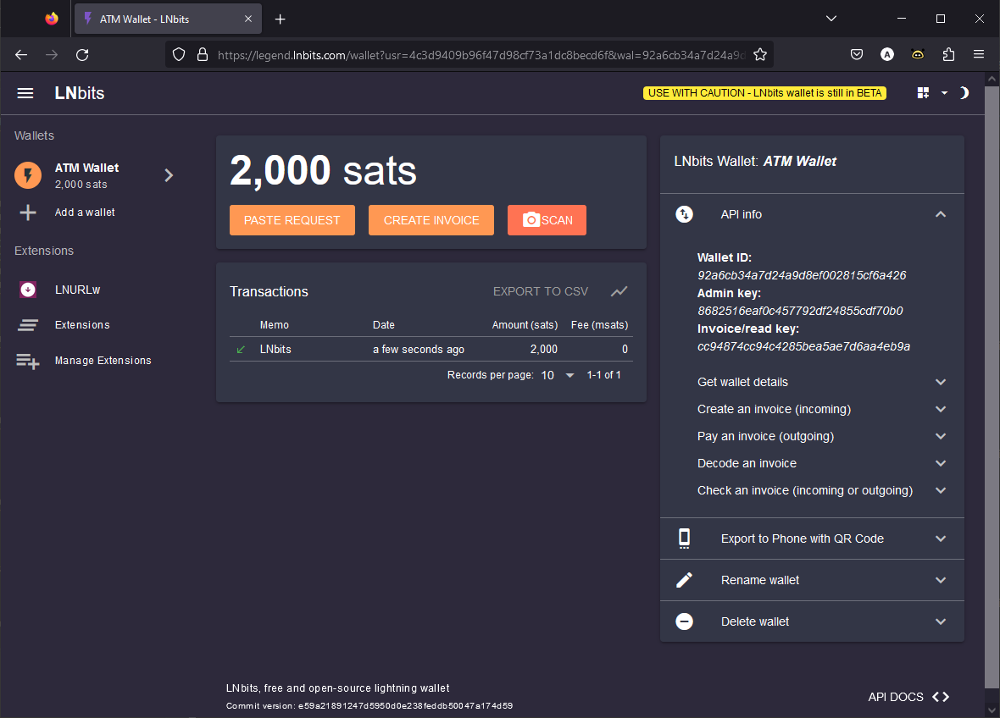

## Quick guide on how to set up an LNbits wallet

- Go e.g. to the [ledgend.lnbits.com](https://legend.lnbits.com/) demo server
- Assign a name and press `ADD A NEW WALLET`
- Bookmark the page and/or copy and paste the URL to a safe place. This will log you in to your wallet.
- Understand the warning! It is a demo server for testing. Keep only the necessary Satoshis in the wallet. 
- See a pop-up menu box on the right or bottom labeled `API info` and open it.
- You should see `Admin key: 8682516eaf0c457...`. The number-letter combination is the 'apikey' that you will need afterwards.
- But before that you need to install an extension. Go to `Extensions`, search for `LNURLw` and activate it with `ENABLE`.
- Fund the wallet with a few thousand Satoshis.

LNbits Wallet

#### [edit_config](/docs/guide/edit_config.md)  ᐊ  previous
