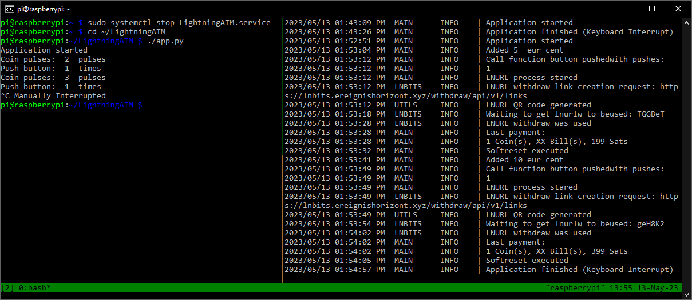

## Monitoring system "tmux" to control the processes

This allows the terminal window to be split vertically into two parts to observe two processes at the same time.

###### Command overview for the terminal multiplexer (tmux) 

```
CTRL + b -> % = split window
CTRL + b -> right or left arrow = change the window
CTRL + b -> CTRL + right or left arrow = move dividing line
CTRL + b -> d = back to single window
```

###### Install tmux

```
$ cd ~
$ sudo apt install tmux    
```

###### Start and use tmux

```
$ tmux
```

- Split tmux windows: `CTRL+b -> %`
- Switch between left and right window: `CTRL + b -> right or left arrow`
- If necessary, move the dividing line: `CTRL+b -> CTRL + arrow right or left`

###### Start the `app.py` process (ATM) in the left window

```
	$ cd ~/LightningATM
	$ ./app.py
```

- Note:  If you have already activated the autostart function, problems can arise if you start the app.py in the tmux window at the same time. Therefore, it is better to end the service for the temx and activate it again later. See next chapter [autostart](/docs/guide/autostart.md).

######  Start `debug.log`

- Switch to the right window and paste or type

```
	$ tail -f ~/.lightningATM/debug.log
```

- Back to single window: `CTRL+b -> d`

Example tmux window



Two withdrawals were made here. Once 5 cents and once 1.60 euros (10 cents + 50 cents + 1 euro). Left side you see the pulses. Right side you see the coins to it. 2 = 5 Cent, 3 = 10 Cent, 5 = 50 Cent, 6 = 1 Euro. The final balance is 152048 satoshis.

---

#### [edit app.py](/docs/guide/edit_app.md)  ᐊ  previous | next  ᐅ  [autostart](/docs/guide/autostart.md)

