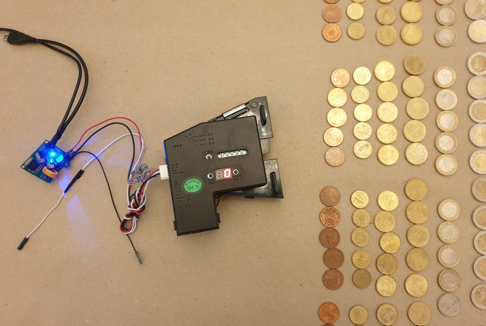

### Prepare the voltage converter

- Cut the micro USB cable. Approx. 15 cm from the Micro USB connector
- Strip both sides and solder together in parallel (++ / --) if you have a soldering iron, otherwise it has to be like this
- Place both ends on the input of the voltage converter and screw tight
- Connect the USB plug to the power pack or USB power pack
- Set the voltmeter to the correct measuring range. At least 35V DC
- Connect a voltmeter on the output side of the converter
- Using a screwdriver, turn the small rotary potentiometer (see picture) several times (probably first to the left) until the voltage shows 12.1 volts
- `Caution:` The initial voltage can be very high. It can be about 35 volts. So do not connect directly to the coin validator!
- Prepare cables for the output side:
- Connect plus (12V) and GND (0V) from the voltage converter to the coin validator
- Join a second wire from GND of the voltage converter (output) to the terminal 25 of the Raspberry Pi
- Check you wiring with pictures and [wiring diagrams](wiring.md)

voltage converter poti

calibrating voltage converter

---

#### [README.md](/README.md)  ᐊ  previous | next  ᐅ  [coin_validator.md](/docs/guide/coin_validator.md)
