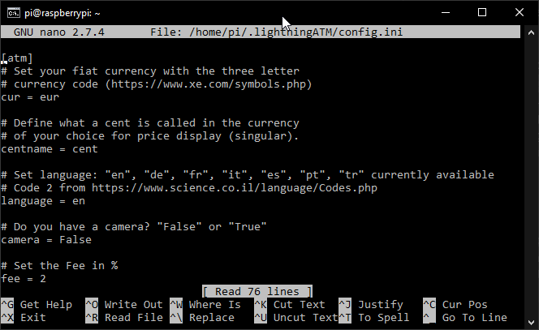

## Stagnation is regression. Update your ATM! 📜🧐

Many updates have been made in the last two months. 💪😅 Updates for more reliability and some nice features. See the [guidelines](https://github.com/21isenough/LightningATM#installation-guideline) for more information and try it out.

--- 
## Steps to update
### 1. Expand the config.ini with "language" and "camera" (If not allready done)

Because we are also expanding the config.ini with this update, we unfortunately have to expand config.ini manually, otherwise we get an error message when starting the ATM. Expanding is not difficult and does not have to be undone later. First we logon again via SSH and stop the LightningATM service and call up the config.ini.

    $ sudo systemctl stop LightningATM.service
    $ nano ~/.lightningATM/config.ini
    
Then we add the following text between `centname = cent` and `# Set the Fee in %`

    # Set language: "en", "de", "fr", "it", "es", "pt", "tr" currently available 
    # Code 2 from https://www.science.co.il/language/Codes.php
    language = en

    # Do you have a camera? "False" or "True"
    camera = False
    

- When you finshed with changings in the config.ini, save and exit the editor: `CTRL+x -> y -> ENTER`
- `Help:` If you want to copy and paste the text, take the text to the clipboard and then place the cursor where you want to paste the text and right-click to paste. But important is just `language = en` and `camera = False`.

### 2. Update to the new version

Logon via SSH and stop the LightningATM service, make a backup from directory LightningATM, clone the new Github to "temp", sync once from "temp" to "LightningAMT" and then delete the "temp" directory that is no longer needed.

    $ sudo systemctl stop LightningATM.service
    $ cp -r -v LightningATM LightningATM_Backup
    $ git clone --branch master https://github.com/21isenough/LightningATM.git temp
    $ rsync -a temp/ LightningATM/
    $ sudo rm -r temp
   
### 3. Start and test the version

    $ cd LightningATM
    $ ./app.py

- It takes a few seconds for the display to update, but then..
- The ATM has started and you can use it normally or test the functions.
- Stop the ATM with `CTRL+C`
- If something went wrong or you just want to watch the ATM, launch a second terminal window, login via ssh and call the debugger: `$ tail -f ~/.lightningATM/debug.log`
- If you like this version, just keep it!

### 4. If you don't like this version and want to get rid of it 

Make the backup the major version again and then delete the backup.

    $ cd
    $ rsync -a LightningATM_Backup/ LightningATM/
    $ sudo rm -r LightningATM_Backup

- Everthing should now be as befor. Even the wallat data.
- You can clean up the coinfig.ini, but you don't have to.

### 5. Final step

Restart the LightningATM service

    $ sudo systemctl start LightningATM.service

- Your ATM should now restart as usual
- If you find some issues or have some suggestions call @AxelHamburch in the telegram group or on Github

## Thank you for your support! ❤️
