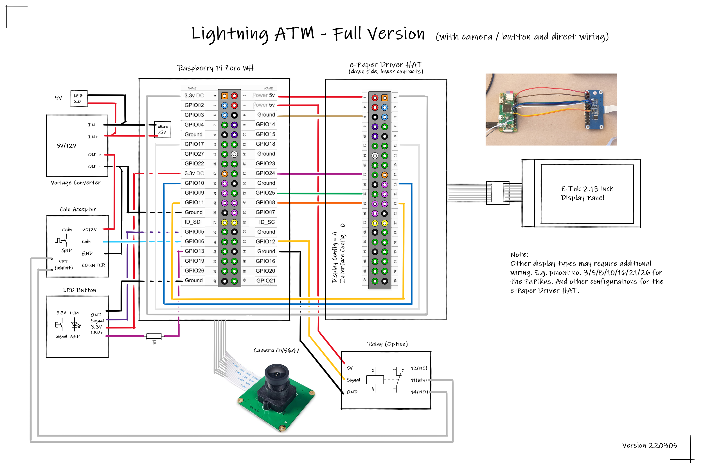

### Hardware wiring

- Wire the hardware according to the pictures, but do not yet install the ATM in the housing
- Set the switch on the e-Paper Display HAT to A and 0
- Be careful when plugging in the fine display ribbon cable!
- The clamp has a small lock and must be released beforehand. See pictures!

Wiring - Full Version

Wiring - Pocket Version

Clamp for ribbon cable

Pocket version adapter cable

Pocket version direct wiring

Pocket version wiring build-in

Pocket version wiring build-in with coin validator             |  Direct wiring, without adapter cable
:-------------------------:|:-------------------------:
  |  

