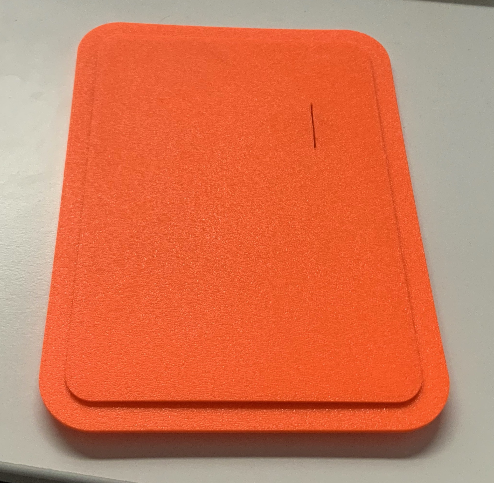

  

# 3D Printed L-ATM Case PE-Edition

Below files can be used to print a case, which lowers your overall costs. The models can be printed  without any supports.

This is the first version and is designed to be used with inserts to mount the Coin-Acceptor as well as the Rasbperry-Pi Zero. For the Coin Acceptor use **M3** inserts [(Amazon)](https://amzn.to/35eNkgj), for the Raspberry-Pi **M2.5** [(Amazon)](https://amzn.to/2HjF0Uo) inserts are needed.
The Lids holds by friction fit.

For the case **needed** are 3 Parts: 
- **Shell**
  
- **Back Lid**
  - two versions
    - normal with 2mm thick plate
    - thicker with 3mm thick plate
- **Top Lid**
  - there are two separate versions:
    - with Lightning-Logo, *for dual color print add a **color change at Z 3.00 mm***. 
    - without any logo
- Mounting Rim
  - optional but *recommended* to properly glue the Top Lid onto the Back Lid.

1. Print Shell / Back Lid / Top Lid / Mounting Rim
2. Use soldering iron to:
   1. Add M3 Inserts into Coin Acceptor holes 
   2. Add M2.5 Inserts into Raspberry holes
   
      
   
   
3. If you have printed the *Mounting Rim* put it around the BackLid
    
4. put glue on the Top Lid and use something to press both together

5. this is what it should look like without the rim

   

